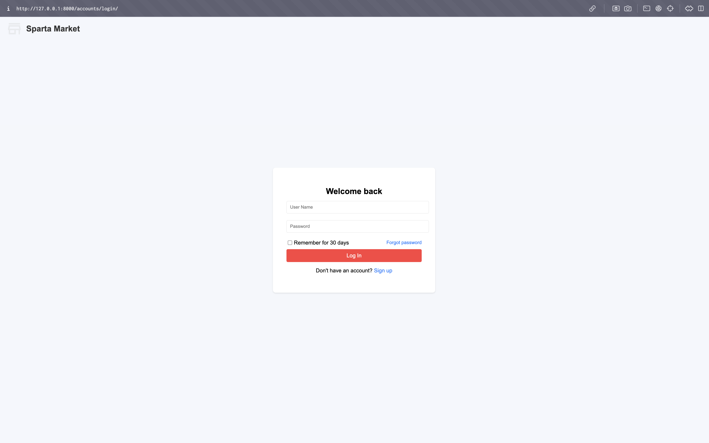
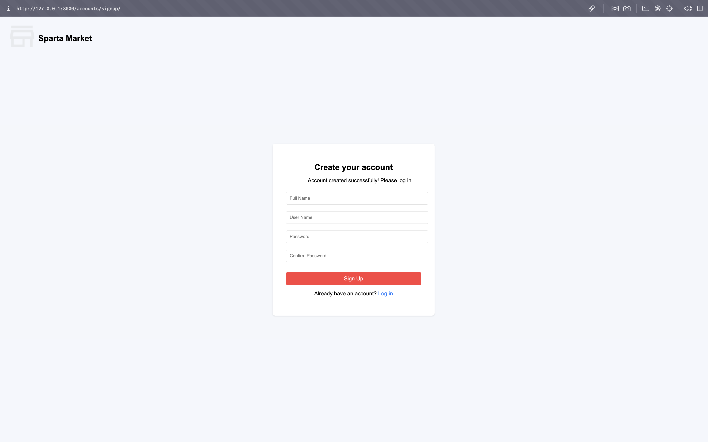
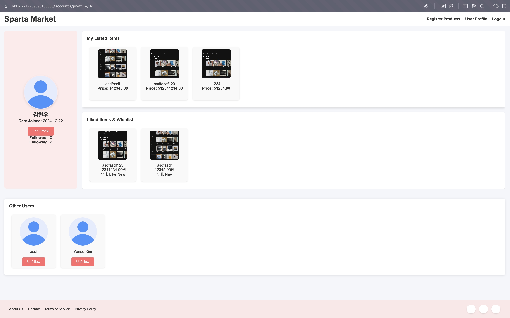
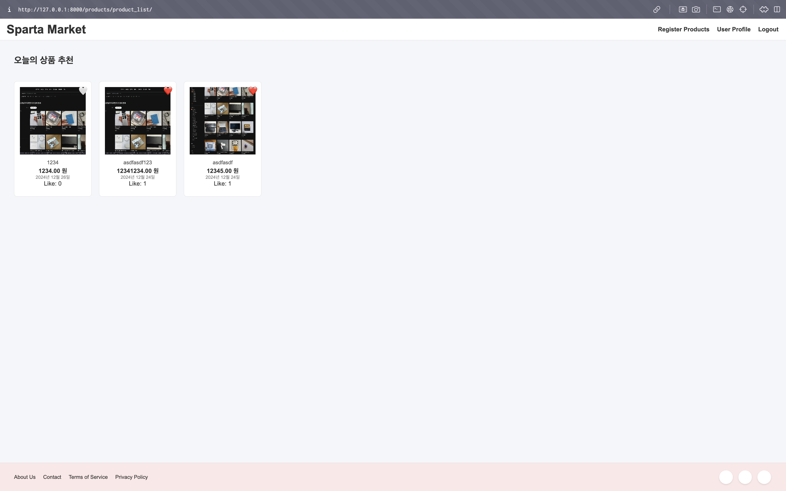

# 🛒 **Sparta Market**

## 📖 **Overview**

- **Sparta Market**은 사용자들이 상품을 등록하고, 구매하며, 찜할 수 있는 **Django 기반의 마켓플레이스 웹 애플리케이션**입니다.
- 회원가입, 로그인, 로그아웃이 가능
- 원하는 상품을 등록하고, 좋아하는 상품을 찜할 수 있음

---

## 🛠️ **Tech Stack**

- **Frontend:** `HTML`, `CSS`, `JavaScript`
- **Backend:** `Django`, `Django Rest Framework (DRF)`
- **Database:** `SQLite`
- **ORM:** `Django ORM`
- **Version Control:** `Git`

---

## 💻 **Installation**

### 1️⃣ **Clone the Repository**

```bash
git clone https://github.com/your-username/sparta-market.git
cd sparta-market
```

---

## 📁 **DirectoryStructure**

Sparta Market/
├── accounts/ # 사용자 인증 및 프로필 관리
│ ├── views.py
│ ├── models.py
│ ├── urls.py
│ ├── templates/
├── products/ # 상품 관리 및 검색
│ ├── views.py
│ ├── models.py
│ ├── urls.py
│ ├── templates/
├── static/ # CSS, JavaScript, 이미지 파일
│ ├── css/
│ ├── js/
| ├── images/
├── templates/ # 공통 템플릿
│ ├── base.html
│ ├── home.html
├── db.sqlite3 # 데이터베이스 파일 (PostgreSQL 사용 권장)
├── manage.py # Django 명령어 관리 파일
└── README.md # 프로젝트 설명서

## 📚 **Features**

### ✅ **1. 회원 관리 (로그인, 로그아웃, 회원가입)**

- 사용자는 회원가입을 통해 계정을 생성할 수 있습니다.
- 로그인 및 로그아웃을 통해 사용자 인증 및 세션 관리가 가능합니다.
- 비밀번호 검증 및 유효성 검사를 통해 보안성을 강화하였습니다.
- **관련 엔드포인트:**
  - `POST /accounts/signup/` – 회원가입
  - `POST /accounts/login/` – 로그인
  - `POST /accounts/logout/` – 로그아웃

<div style="display: flex; justify-content: space-between; align-items: center;">
  
  <!-- 왼쪽 이미지 -->
  <div style="text-align: center; flex: 1;">
    <h4>로그인 페이지</h4>
    
  </div>
  
  <!-- 오른쪽 이미지 -->
  <div style="text-align: center; flex: 1;">
    <h4>회원가입 페이지</h4>
    
  </div>
  
</div>

---

### ✅ **2. 개인 프로필 기능**

- 사용자는 자신의 프로필을 확인할 수 있습니다.
- 프로필에는 사용자 이름, 이메일, 프로필 사진, 자기소개, 가입 날짜 등이 표시됩니다.
- 사용자가 등록한 상품 목록 및 찜한 상품 목록이 표시됩니다.
- **관련 엔드포인트:**
  - `GET /accounts/profile/<user_id>/` – 프로필 조회

---

### ✅ **3. 팔로우 / 언팔로우**

- 사용자는 다른 사용자를 팔로우하거나 언팔로우할 수 있습니다.
- 팔로워 및 팔로잉 목록을 확인할 수 있습니다.
- **관련 엔드포인트:**

  - `POST /accounts/follow/<user_id>/` – 사용자 팔로우
  - `DELETE /accounts/unfollow/<user_id>/` – 사용자 언팔로우

    <div style="text-align: center; flex: 1;">
      <h4>프로필 페이지</h4>
    </div>
  

---

### ✅ **4. 찜하기 기능**

- 사용자는 관심 있는 상품을 찜(좋아요)할 수 있습니다.
- 한 번 더 클릭하면 찜하기를 취소할 수 있습니다.
- 각 상품에는 좋아요 수가 표시됩니다.
- **관련 엔드포인트:**
  - `POST /products/product_like/<product_id>` – 상품 찜하기/취소

---

### ✅ **5. 물건 등록 / 수정 / 삭제**

- 사용자는 새로운 상품을 등록할 수 있습니다.
- 등록한 상품의 정보를 수정하거나 삭제할 수 있습니다.
- 각 상품에는 여러 이미지를 첨부할 수 있습니다.
- **관련 엔드포인트:**

  - `GET /products/product_list/` – 상품 목록
  - `GET /product_detail/<int:product_id>/` – 상품 개별 조회
  - `POST /products/product_create/` – 상품 등록
  - `PUT /products/product_edit/<int:product_id>` – 상품 수정
  - `DELETE /products/product_delete/delete/` – 상품 삭제

    <div style="text-align: center; flex: 1;">
      <h4>물건 목록 페이지</h4>
    </div>
  
